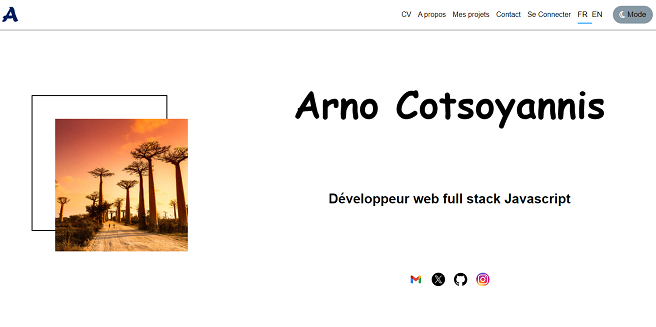

## Description

Portfolio contenant mes projets principaux réalisés pendant ma formation Openclassrooms ainsi que des projets personnels. Ce site a été codé en React JS. J'ai pu utiliser entre autre le hook useContext afin de gérer le mode clair/sombre du site, ainsi que la préférence de langue de l'utilisateur (anglais ou français).  
Ce site utilise une API REST que vous pouvez retrouver [ici](https://github.com/AvirKarakitsos/OC_project8_portfolio_backend).  
Le lien du site se trouve [ici](https://arnocotsoyannis-portfolio.onrender.com/)  

**Tags**: *React, useContext, hooks*

<p align="center">
  
</p>

### Installation

```
npm install
```  